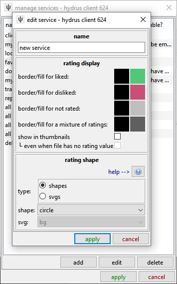
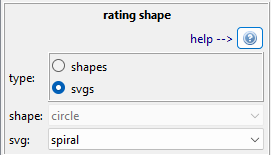

# getting started with ratings  

The hydrus client supports two kinds of ratings: _like/dislike_ and _numerical_. Let's start with the simpler one:

## like/dislike { id="like_dislike" }

A new client starts with one of these, called 'favourites'. It can set one of two values to a file. It does not have to represent like or dislike--it can be anything you want, like 'send to export folder' or 'explicit/safe' or 'cool babes'. Go to _services->manage services->add->local like/dislike ratings_:

You can set a variety of colours and shapes.

## numerical

This is '3 out of 5 stars' or '8/10'. You can set the range to whatever whole numbers you like:

As well as the shape and colour options, you can set how many 'stars' to display and whether 0/10 is permitted.
You can also set a custom distance between 'stars' in the row. This used to be 0 and now has a default padding of 4 pixels with the new draw system. You can also now set it to negative.
As an example the square 3/5 rating below is using 0 padding and the 4/5 'crescent moon' shape rating is using -4 padding.

If you change the star range at a later date, any existing ratings will be 'stretched' across the new range. As values are collapsed to the nearest integer, this is best done for scales that are multiples. 2/5 will neatly become 4/10 on a zero-allowed service, for instance, and 0/4 can nicely become 1/5 if you disallow zero ratings in the same step. If you didn't intuitively understand that, just don't touch the number of stars or zero rating checkbox after you have created the numerical rating service!

## inc/dec

This is a simple counter. It can represent whatever you like, but most people usually go for 'I x this image y times'. You left-click to +1 it, right-click to -1.

## svg ratings

We are experimenting with svg ratings:

There are some already in `install_dir/static/star_shapes`--feel free to add your own to `db_dir/static/star_shapes`. Go for something simple that mostly fills a squarish, transparent background.

The program will try to draw the sillhouette of the svg with the chosen colours:

More complicated shapes obviously look better at higher resolution, which you can now set in `options->media viewer hovers` and `options->thumbnails`. We are going to keep working on this, and I expect to migrate all the old polygons to nicer svg once we have this nailed down. 

## now what? { id="using_ratings" }

Ratings are displayed in the top-right of the media viewer:

Hovering over each control will pop up its name, in case you forget which is which.

For like/dislike:

- **Left-click:** Set 'like'
- **Right-click:** Set 'dislike'
- **Second X-click:** Set 'not rated'

For numerical:

- **Left-click:** Set value
- **Right-click:** Set 'not rated'

For inc/dec:

- **Left-click:** +1
- **Right-click:** -1

Pressing F4 on a selection of thumbnails will open a dialog with a very similar layout, which will let you set the same rating to many files simultaneously.

Once you have some ratings set, you can search for them using system:rating, which produces this dialog:

On my own client, I find it useful to have several like/dislike ratings set up as quick one-click pseudo-tags. Stuff like 'this would make a good post' or 'read this later' that I can hit while I am doing archive/delete filtering.

## customizing ratings display { id="customizing_ratings" }

There are now various granular settings for customizing ratings display, found in the relevant 'options' panels.
- 'media viewer' - customize the size of ratings icons
- 'thumbnails' - customize the size of ratings icons or collapse numerical ratings services, as shown below

