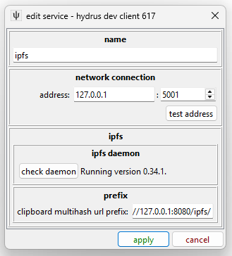
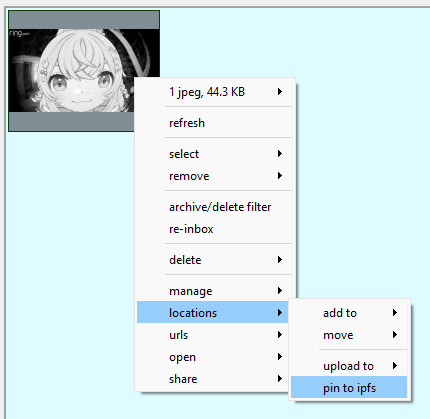
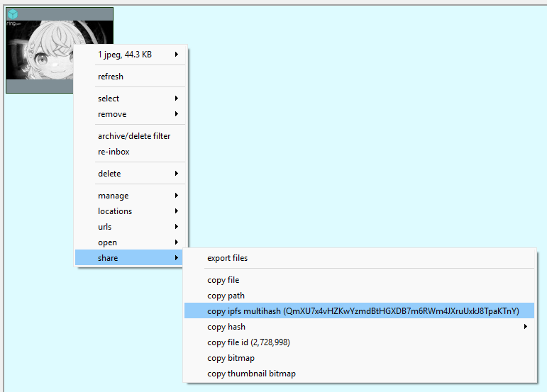
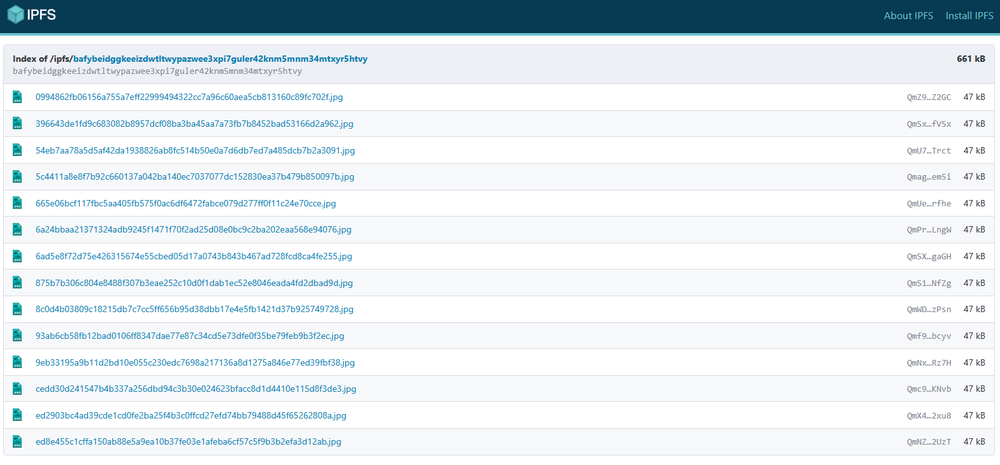
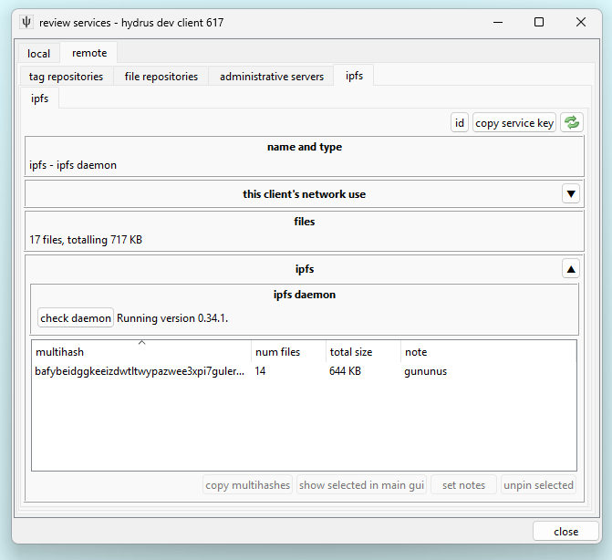

# IPFS

IPFS is a p2p protocol that makes it easy to share many sorts of data. The hydrus client can communicate with an IPFS daemon to send and receive files.

You can read more about IPFS from [their homepage](http://ipfs.tech).

For our purposes, we only need to know about these concepts:

*   **IPFS daemon** \-\- A running instance of the IPFS executable that can talk to the larger network.
*   **IPFS multihash** \-\- An IPFS-specific identifier for a file or group of files.
*   **pin** \-\- To tell our IPFS daemon to host a file or group of files.
*   **unpin** \-\- To tell our IPFS daemon to stop hosting a file or group of files.

## getting ipfs { id="getting_ipfs" }

IPFS used to mostly be just an executable, but it now comes as a much nicer [desktop package](https://docs.ipfs.tech/install/ipfs-desktop/). I recommend using this as you are learning.

Just install and run it, and it will handle the technical side of things. Once it is up, if it all seems to be happy and connected to the network, open [this page](http://127.0.0.1:8080/ipfs/QmfM2r8seH2GiRaC4esTjeraXEachRt8ZsSeGaWTPLyMoG), and it should download and display an example 'Hello World!' file from \~\~\~across the internet\~\~\~.

Your daemon listens for other instances of ipfs using port 4001, so if you need to open that port in your firewall/router, make sure you do. It presents an API on port 5001 and an http interface for your browser on 8080. Putting `http://127.0.0.1:8080/ipfs/[multihash]` into your browser should load up that multihash, which for our purposes will usually be a file or a directory of more multihashes.

!!! info "Slow Access"
    IPFS can be very slow. Even if you know that your friend has a file pinned, it can take time for your request to propagate across the network and connect you to his node. If you try to hit year-old multihashes, expect to get a lot of timeouts (the files are almost certainly no longer pinned by any active daemon across the network).
    
    Similarly, if you turn your daemon off and thus disconnect from the network, it cannot serve anything you have pinned to anyone else.

## connecting your client { id="connecting" }

IPFS daemons are treated as services inside hydrus, so go to _services->manage services->add->ipfs daemon_. You will probably want to use credentials of `127.0.0.1:5001`. Click 'test address' to make sure everything is working.

Thereafter, you will get the option to 'pin' and 'unpin' from a thumbnail's right-click menu, like so:

This works like hydrus's repository uploads--it won't happen immediately, but instead will be queued up at the pending menu.

!!! warning
    We are in a danger area here! If you pin a file and then tell someone the multihash, consider it now public! You do not control what happens to a pinned file after the first person downloads it from you. You can unpin it, but as long as someone else keeps it pinned, that file will live forever on IPFS. Be careful!

Commit all your pins when you are ready:

Notice how the IPFS icon appears on your pending and pinned files. You can search for these files by changing the file domain (where it normally says "my files" in the autocomplete dropdown) or by using 'system:file service'.

Unpin works the same as pin.

Right-clicking any pinned file will give you a new 'share' action:

Which will put it straight in your clipboard.

If you want to share a pinned file with someone, you have to tell them that multihash. They can then:

*   View it through their own ipfs daemon's gateway, at `http://127.0.0.1:8080/ipfs/[multihash]`
*   View it through a public web gateway, such as the one the IPFS people run, at `http://ipfs.io/ipfs/[multihash]`

You can also paste one of these URLs into any normal hydrus downloader.

!!! info "URL Prefix"
    If you put in `http://127.0.0.1:8080/ipfs/` in the clipboard prefix field in _manage services_, then any time you copy a multihash, you'll actually copy the whole valid URL that fetches it. You could also use a public gateway prefix, or an externally visible host for your local IPFS instance.

## directories { id="directories" }

If you have many files to share, IPFS also supports directories. IPFS directories use a similar multihash as files, and will appear as a directory listing in any web browser:

You may recognise those hash filenames--this example was created by hydrus, which can create ipfs directories from any selection of files from the same right-click menu:

Hydrus will pin all the files and then wrap them in a directory, showing its progress in a popup. Your current directory shares are summarised on the respective _services->review services_ panel:

Hydrus used to support native downloads of IPFS multihashes, including directories, but it ended up a bit of a mess. I expect to reintroduce it in a nicer format in future. For now, please use the URL downloader.
